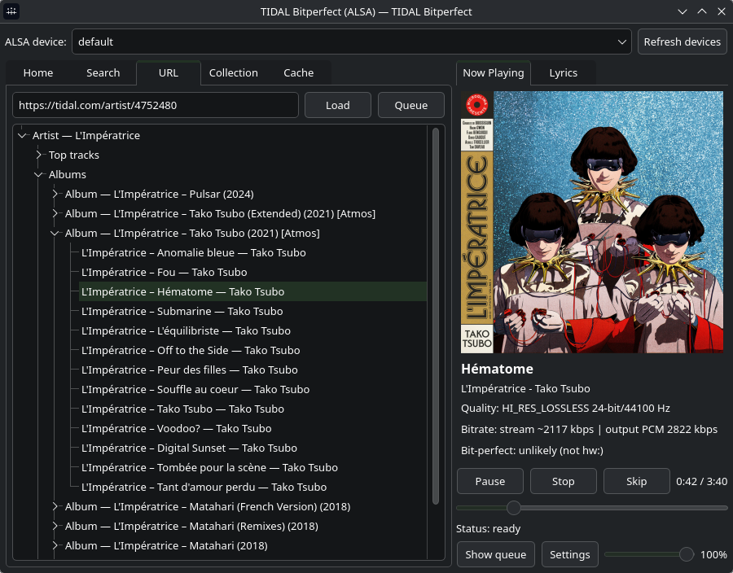

<a href="packaging/linux/tidal-bitperfect.svg">
  
</a>

# TIDAL Bitperfect

<p align="center">
  
</p>

Linux TIDAL player with direct ALSA output, smart caching, and offline support.

## Features

- **Direct ALSA playback** - bit-perfect output with device selection
- **Smart caching** - automatic cache + dedicated downloads folder with offline mode
- **Full library access** - search, collections (favorites sync), playlists, albums, artists
- **Queue & radio** - background queue with context actions and track radio
- **Gapless playback** - seamless track transitions with background prefetch
- **Lyrics panel** - line-synced lyrics when TIDAL provides them
- **FLAC downloads** - proper tagging and embedded cover art
- **Discord Rich Presence** - optional integration to show what you're playing
- **MPRIS D-Bus integration** - media keys, playerctl, KDE Connect support
- **Volume control** - PulseAudio/ALSA mixer support (disabled in bit-perfect mode)

## Install

Create a venv and install dependencies:

```bash
python -m venv .venv
source .venv/bin/activate
pip install -r requirements.txt
```

Or install as a package (adds a `tidal-bitperfect` command):

```bash
pip install .
```

## Run

GUI (recommended):

```bash
python tidal_app.py
```

Or, if installed:

```bash
tidal-bitperfect
```

## Usage

### Tabs

- **Search**: search for tracks/albums/playlists/artists
- **URL**: paste TIDAL links (track/album/playlist/artist)
- **Collection**: view synced favorites (tracks/albums/playlists/artists)
- **Cache**: view cached/downloaded tracks, enable offline playback

### Keyboard Shortcuts

**Navigation:**
- `Ctrl+1/2/3`: switch tabs (Search/URL/Collection)
- `Ctrl+F`: focus search box
- `Ctrl+L`: focus URL box
- `F5` / `Ctrl+R`: refresh ALSA devices / retry login

**Playback:**
- `Ctrl+Enter` / `Ctrl+Space` / `K`: play/pause
- `Ctrl+Shift+Enter`: skip to next track
- `Ctrl+.` / `Esc`: stop
- `Ctrl+Left/Right` or `J/L`: seek -10s / +10s

### Settings

- **Cache sizing**: configure max cache size, clear tracks/covers
- **Downloads**: manage downloaded tracks separately from cache
- **Diagnostics**: debug logging, disable ffmpeg/cache, force fresh login
- **Discord RPC**: enable Rich Presence with custom client ID
- **MPRIS**: enable D-Bus media player interface for desktop integration

### Context Menus

Right-click on tracks, albums, playlists, or artists for actions like:
- Play next / Append to queue / Remove from queue
- Download / Delete from cache
- Open album/artist
- Favorite/Unfavorite
- Queue track radio

## Requirements

- Linux + ALSA
- Python 3.10+
- `ffmpeg` (for DASH/manifest streams and downloads)
- `libsndfile` (for in-process FLAC decoding)

**Python dependencies:**
- `tidalapi`
- `pyalsaaudio`
- `PySide6`
- `soundfile`
- `mutagen` (FLAC tagging)

**Optional:**
- `pypresence` (Discord Rich Presence)
- `dbus-fast` (MPRIS D-Bus integration)

Install optional dependencies:

```bash
pip install pypresence dbus-fast
```

## Cache & Offline Mode

Cache location: `~/.cache/tidal-bitperfect`

- `audio/`: automatically cached tracks (size-limited, managed by app)
- `covers/`: downscaled album art (max 1280px)
- `downloads/`: user-triggered downloads (not counted against cache limit)

When offline, the app plays from cache and downloads. Use the Cache tab to manage stored tracks.

## Desktop Integration

The app sets a stable app ID: `tidal-bitperfect`.

Install the desktop file:

```bash
mkdir -p ~/.local/share/applications
cp packaging/linux/tidal-bitperfect.desktop ~/.local/share/applications/
```

Install the icon:

```bash
mkdir -p ~/.local/share/icons/hicolor/scalable/apps
cp packaging/linux/tidal-bitperfect.svg ~/.local/share/icons/hicolor/scalable/apps/
```

Edit the `Exec=` line in the `.desktop` file if using a venv.

## How Playback Works

- **Preferred**: direct FLAC stream decoded in-process via `soundfile`
- **Fallback**: ffmpeg decodes DASH/manifest streams to PCM
- **Output**: PCM written directly to ALSA (no DSP)

## Notes

- Output is bit-perfect (no player DSP), but some DACs reject packed 24-bit (`S24_3LE`). The app outputs padded 24-in-32 for reliability.
- Seeking on streaming/DASH inputs is approximate.
- Offline mode requires cached or downloaded tracks.
- Discord timer increments continuously from last RPC update (Discord API limitation).

## Legacy CLI

A CLI player is still available:

```bash
python tidal_bitperfect.py --query "aphex twin flim" --pick
```
